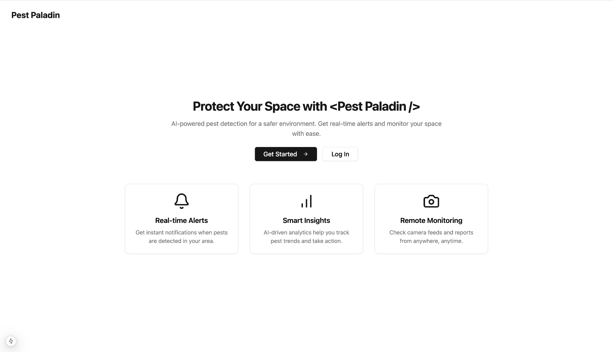
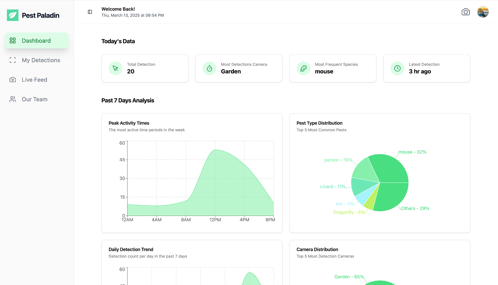
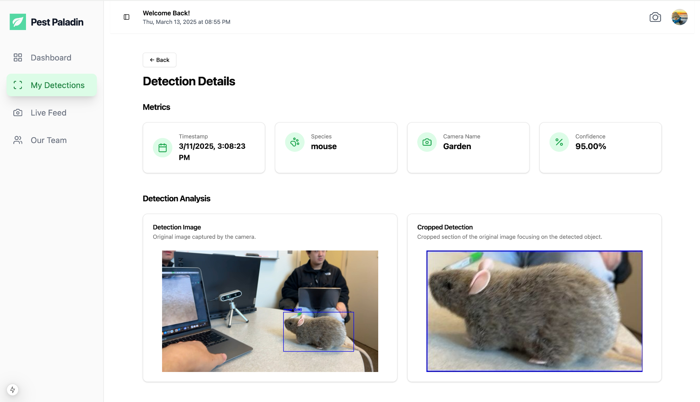
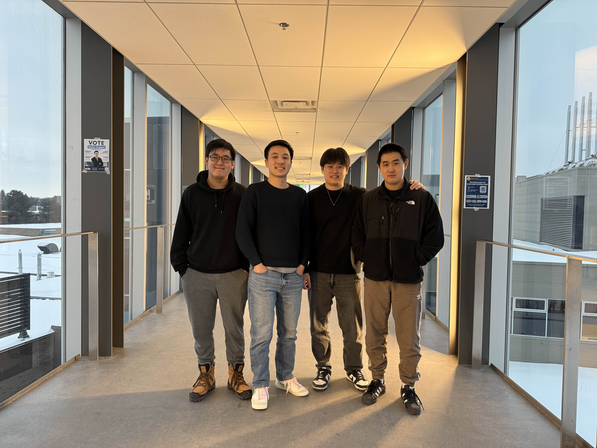

# Pest Paladin - UW 2025 ECE Final Year Design Project

## Project Abstract

**Pest Paladin** is a smart pest monitoring system designed for homes, businesses, and agriculture. Leveraging **computer vision** and **machine learning**, Pest Paladin provides real-time detection, identification, and tracking of pests through smart cameras.

The system is designed to be compatible with:

- **Existing home security systems**
- **Webcams**
- **Custom IoT setups**

**Pest Paladin** offers flexibility for both home and commercial users, providing insights via mobile and web applications. The system delivers:

- **Real-time notifications**
- **Visual analytics**
- **Detailed pest detection reports**

---

## Web Client Screenshots

### Home Page

The landing page introduces the system's key features.

### Dashboard

The dashboard presents key insights including total detections, most active cameras, common pest types, and detection trends over the past 7 days.

### Detection Details

Detailed view of individual detections with metadata, original image, and cropped detection for better visualization.

---

## Design Resources

For a comprehensive understanding of the system's design and architecture, please refer to the following resources:

- **Figma Design File:** [Pest Paladin UI Design](https://www.figma.com/design/gT6mXIZvYH9NOIDqUcC3JM/Brian-Wu?node-id=0-1\&p=f\&t=gHQ8yyVTOElyJcmk-0)
- **Design Document:** [Pest Paladin Web Client and Server Design Doc](https://www.notion.so/Pest-Paladin-Web-Client-and-Server-Design-Doc-18e65c86420580358d5ee50f0396a526?pvs=4)

---

## Features

✅ Real-time pest detection and alerts\
✅ Smart analytics with visualized data trends\
✅ User-friendly web and mobile interface\
✅ Integrates seamlessly with smart cameras and IoT setups\
✅ Supports multiple detection categories (mice, insects, etc.)

---

  

## Team Members

- **Jordan Fang**
- **Andrew Liu**
- **Jiyu Liu**
- **Brian Wu**

---

## Contact

For questions or further information, feel free to reach out to our team. We are excited to share our project and its potential for enhancing pest monitoring solutions!